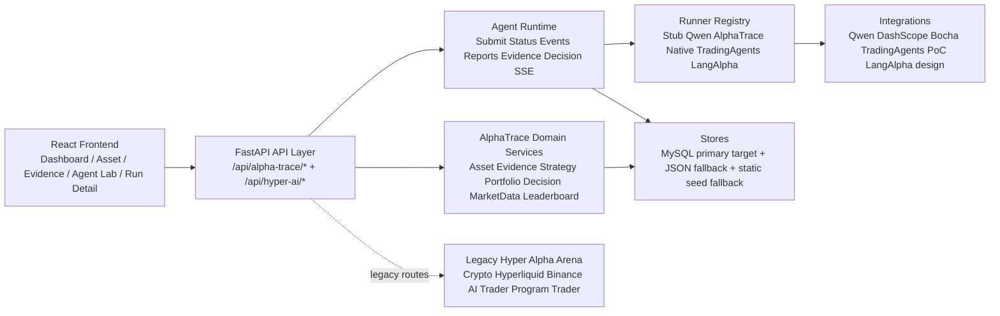
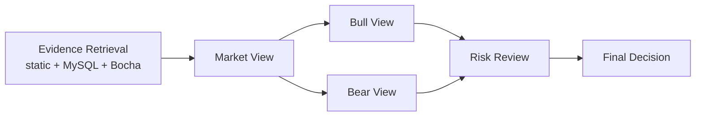
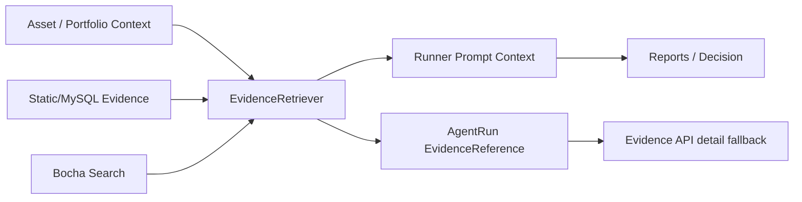

# AlphaTrace Full-Stack Architecture

Last updated: 2026-05-04

This is the canonical full-stack architecture map for AlphaTrace. It complements `docs/PROJECT_SPEC.md`, `docs/EXECUTION_PLAN.md`, `docs/IMPLEMENTATION_LOG.md`, and `docs/VALIDATION.md`.

Historical architecture notes under `docs/engineering/` remain useful context, but future implementation should resolve conflicts in favor of this document and the canonical execution plan.

## 1. Architectural Intent

AlphaTrace is an evidence-aware investment research workbench. It is not a crypto trading bot and not a frontend wrapper over TradingAgents.

The target product backend is AlphaTrace-owned:

1. Frontend consumes only AlphaTrace schemas.
2. Backend owns product domain models, runtime records, evidence, decisions, settings, and persistence.
3. Agent runners are execution adapters. They do not define frontend contracts.
4. MySQL is the formal persistence target; JSON store remains local fallback.
5. TradingAgents is an optional PoC/reference runner, not the main backend.
6. LangAlpha is architecture reference / future external service adapter candidate.
7. Legacy Hyper Alpha Arena crypto/trading modules are preserved but treated as legacy unless explicitly pulled into AlphaTrace through a clean domain boundary.

## 2. Runtime / Port Topology

Current local topology:

| Port | Role | Notes |
|---|---|---|
| `8802` | Docker FastAPI backend | Uvicorn listens inside app container; canonical backend API path is `/api/*`. |
| `8804` | Older Vite/dev frontend instance | May still be running from previous sessions; not canonical unless explicitly started. |
| `8805` | Current Vite real-mode frontend/proxy | Used in current validation. Frontend API calls target `/api`, proxied to backend. |
| `8813` | Local backend candidate from earlier experiments | Not canonical unless explicitly started for local venv/TradingAgents tests. |

Canonical current interactive path:

```text
Browser -> http://127.0.0.1:8805/dashboard#...
Vite/proxy -> http://127.0.0.1:8805/api/...
Docker backend -> http://127.0.0.1:8802/api/...
```

## 3. High-Level System Map



## 4. Backend Architecture

### 4.1 Backend Directory Roles

| Path | Role | AlphaTrace stance |
|---|---|---|
| `backend/main.py` | FastAPI app, startup hooks, router registration | Shared app entrypoint. Contains legacy startup gates. |
| `backend/api/alpha_trace_*_routes.py` | AlphaTrace REST/SSE API layer | Product-facing API layer. Keep stable. |
| `backend/schemas/alpha_trace_*.py` | AlphaTrace API/domain schemas | Frontend contracts are derived from these shapes. |
| `backend/services/alpha_trace_agent_runtime_service.py` | Agent runtime orchestration service | Product runtime facade. |
| `backend/services/agent_runners/` | Runner adapters | Execution engines only. Must map to AlphaTrace schemas. |
| `backend/services/agent_orchestrator/` | Runner capability / execution policy / flow descriptors / task specs | Declares runner availability, execution boundary, DAG vocabulary, and future scheduler inputs. |
| `backend/services/agent_runtime_store/` | AgentRun persistence abstraction | MySQL / JSON / memory implementations. |
| `backend/services/async_tasks/` | Async task specs, stores, and in-process scheduler boundary | Future worker/cancel/retry/timeout layer; current submit wiring remains guarded. |
| `backend/services/runtime_config/` | Sanitized runtime config diagnostics | Qwen/Bocha/TradingAgents/LangAlpha readiness without exposing secrets. |
| `backend/services/integration_adapters/` | Data/model/tool/workbench adapter contracts and wrappers | Entry point for Bocha, Qwen provider, market data, ToolAdapters, and future OSS components. |
| `backend/services/data_api/` | AlphaTrace data API catalog | Product-owned API/provider/store catalog; separates ETF market data from legacy BTC routes. |
| `backend/services/agent_artifacts/` | AgentArtifact contract/store/mappers | Product-owned artifacts for future files/tables/charts/web URLs from tools or external workbenches. |
| `backend/services/domain_store/` | Shared MySQL domain store helpers | Product persistence infrastructure. |
| `backend/services/*_store/` | Asset/Evidence/Strategy/Portfolio/Decision/Leaderboard/MarketData stores | Domain-specific read/write services. |
| `backend/services/evidence_retrieval/` | Evidence retrieval, static seed, Bocha/external search, support scoring | Evidence is a first-class product domain. |
| `backend/integrations/` | External service clients | Bocha, future providers. API keys backend-only. |
| `backend/database/` | Existing database/session/model infrastructure | Shared with legacy; AlphaTrace uses it for MySQL direction where implemented. |
| `backend/api/*legacy routes*` | Original Hyper Alpha Arena APIs | Legacy unless explicitly routed through AlphaTrace domain boundaries. |

### 4.2 Backend API Families

AlphaTrace API family:

| API | Route file | Purpose |
|---|---|---|
| Agent Runtime | `alpha_trace_agent_runtime_routes.py` | submit, demo, detail, events, SSE, reports, evidence, decision, status, capabilities, workers/logs. |
| Evidence | `alpha_trace_evidence_routes.py` | evidence list/detail/search, static/MySQL/run-scoped fallback. |
| Asset | `alpha_trace_asset_routes.py` | asset list/detail/evidence. |
| Strategy | `alpha_trace_strategy_routes.py` | strategy list/detail/assets/evidence. |
| Portfolio | `alpha_trace_portfolio_routes.py` | portfolio list/detail/holdings/recommendations/assets/strategies/decisions. |
| Decision | `alpha_trace_decision_routes.py` | decisions projected from AgentRun/MySQL/static seed; evidence and run link. |
| Leaderboard | `alpha_trace_leaderboard_routes.py` | runtime quality ranking, not real investment performance. |
| Market Data | `alpha_trace_market_data_routes.py` | AlphaTrace ETF/fund/index/future quote/snapshot/klines/indicators static-seed v1. |

Support API family:

| API | Route file | Purpose |
|---|---|---|
| Runtime credentials/settings | `hyper_ai_routes.py` | Qwen/Bocha/DashScope config status and key saving through backend. |
| System logs | `system_log_routes.py` | Raw/global logs; not canonical AgentRun events. |
| Legacy trading/crypto APIs | many existing route files | Retained for original product; not AlphaTrace core. |

### 4.3 Startup and Legacy Boundary

`backend/main.py` has profile gates:

1. `ALPHATRACE_BACKEND_PROFILE`
2. `ALPHATRACE_LEGACY_RUNTIME_ENABLED`
3. `ALPHATRACE_FRONTEND_WATCHER_ENABLED`

Current Docker startup still runs legacy services by default, which causes BTC/Hyperliquid logs. This is known and intentionally deferred unless it blocks AlphaTrace work.

Architectural rule:

1. AlphaTrace market data must not depend on the legacy BTC stream.
2. Legacy logs can be shown as an advanced/global diagnostic panel, but AgentRun truth is the structured runtime event stream.
3. Future AlphaTrace-only startup profile should disable legacy startup services without deleting legacy routes.

## 5. Agent Runtime Architecture

### 5.1 Runtime Data Model

Canonical runtime contract:

```text
AgentRun
  AgentRuntimeEvent[]
  AgentReport[]
  EvidenceReference[]
  AgentDecision
  RuntimeMetrics
```

Runtime truth:

1. `/submit` returns immediately for async runners.
2. Runtime events are appended during execution.
3. SSE streams events from store.
4. Completed runs persist reports/evidence/decision.
5. Failed runs persist failed status and error events.
6. Frontend must not infer product truth from backend raw logs.

### 5.2 Runner Registry

Current runners:

| runnerType | Role | Status | Boundary |
|---|---|---|---|
| `stub` | Deterministic smoke runner | Always available | No model calls. |
| `qwen` | Direct Qwen research runner | Ready when Qwen key configured | Generic Qwen path. |
| `alphatrace_native` | AlphaTrace-owned product multi-agent DAG | Product-facing native runner v1 | Reuses Qwen/Bocha/evidence/DAG path; not TradingAgents. |
| `tradingagents` | Opt-in PoC/reference runner | Disabled by default | Optional TradingAgents process/venv, no frontend internal state exposure. |
| `langalpha` | Design-only external service adapter candidate | Disabled | Do not import/execute in MVP. |

### 5.3 Native Agent Flow

Current native flow:



Implementation note:

1. `alphatrace_native` currently subclasses the proven Qwen runner path.
2. This is intentional for v1 to avoid duplicated orchestration bugs.
3. It gives the product a stable runner boundary while keeping TradingAgents separate.
4. Future work can move this into a dedicated orchestrator without changing frontend schema.

### 5.4 Streaming and Observability

Observability layers:

| Layer | Source | Frontend panel |
|---|---|---|
| Structured runtime events | AgentRunStore | Runtime Event Stream, Progress Board, Tool Timeline |
| Live model chunks | `reasoning.chunk` events with streaming payload | Current Report / Live Output |
| Reports | AgentRun reports | Research Report sections |
| Evidence refs | AgentRun evidence + Evidence API fallback | Evidence Used / Evidence Center |
| Raw backend logs | process log tail | Advanced backend runtime log only |

Architectural rule:

Structured runtime events are authoritative. Raw process logs are diagnostic only.

## 6. Persistence Architecture

### 6.1 Store Strategy

Current target:

1. MySQL 8.0+ is the formal product persistence target.
2. JSON store remains local fallback.
3. Static seed remains demo fallback for domain objects.

Store types:

| Store | Current role |
|---|---|
| `AgentRunStore` | Runtime persistence for runs/events/reports/evidence/decisions. MySQL + JSON + memory implementations exist. |
| `AssetStore` | Asset domain, static/MySQL seed backed. |
| `EvidenceStore` | Evidence domain, static/MySQL/run-scoped fallback. |
| `StrategyStore` | Strategy domain. |
| `PortfolioStore` | Portfolio domain. |
| `DecisionStore` | Decision domain and AgentRun-derived projections. |
| `LeaderboardStore` | Runtime quality ranking projection. |
| `MarketDataStore` | AlphaTrace static market data v1. |
| `SystemConfigStore` | Runtime credentials/config, including Qwen/Bocha/DashScope where implemented. |

### 6.2 MySQL Principles

1. Query-critical fields must be typed columns.
2. Flexible raw payloads can live in JSON columns.
3. Runtime events should index by `(run_id, sequence)` and `(run_id, type)`.
4. Evidence should index by `evidence_id`, `source_type`, `evidence_type`, and asset relation.
5. API keys must be encrypted or stored through existing backend credential mechanism; frontend never sees raw values after save.
6. JSON fallback must be switchable for local recovery.

## 7. Evidence Architecture

Evidence is a first-class domain, not just prompt text.

Sources:

1. Static evidence seed.
2. MySQL evidence store.
3. Bocha external search evidence.
4. AgentRun-scoped evidence refs.
5. Future file/report/crawler/professional data providers.

Evidence flow:



Rules:

1. Bocha evidence must preserve source URL and summary.
2. `ev_bocha_*` ids must be resolvable after run completion.
3. Evidence id validation is current baseline.
4. Semantic support scoring is a future governance layer.
5. If external search fails, fallback to static evidence and mark quality accordingly.

## 8. Frontend Architecture

### 8.1 Frontend Directory Roles

| Path | Role |
|---|---|
| `frontend/app/pages/` | Route-level pages for AlphaTrace workspaces. |
| `frontend/app/entities/` | Entity API/model adapters. This is the frontend domain boundary. |
| `frontend/app/shared/api/` | API mode, endpoints, HTTP client, SSE client. |
| `frontend/app/shared/ui/` | Reusable AlphaTrace UI components. |
| `frontend/app/shared/lib/` | Navigation, runtime mappers, utility logic. |
| `frontend/app/mocks/` | Mock mode data. Must stay available. |
| `frontend/app/components/` | Legacy/shared original product components. Use carefully for AlphaTrace. |

### 8.2 Page Map

| Page | Purpose | Real API entity boundary |
|---|---|---|
| `DashboardPage.tsx` | Entry dashboard | mixed dashboard APIs |
| `AssetResearchPage.tsx` | Asset list/search | `entities/asset` |
| `AssetDetailPage.tsx` | Asset detail + market/evidence context | `asset`, `evidence`, market data |
| `EvidenceCenterPage.tsx` | Evidence list/detail/source preview | `entities/evidence` |
| `StrategyLabPage.tsx` | Strategy list/detail | `entities/strategy` |
| `PortfolioWorkspacePage.tsx` | Portfolio detail/diagnosis entry | `entities/portfolio`, `agent` |
| `AgentLabPage.tsx` | Runner selection, submit, diagnostics | `entities/agent`, `settings` |
| `AgentRunDetailPage.tsx` | Runtime observability/replay | `entities/agent`, `evidence` |
| `DecisionAttributionPage.tsx` | Decision list/detail/evidence/run link | `entities/decision` |
| `LeaderboardPage.tsx` | Runtime quality ranking | `strategy` / leaderboard APIs |
| `DataSourcesPage.tsx` | Data source management placeholder/v1 | `entities/data-source` |
| `SettingsPage.tsx` | Runtime credentials/config diagnostics | `entities/settings` |

### 8.3 Frontend Data Rules

1. Pages should call `entities/*/api.ts`, not raw fetch directly.
2. `shared/api/endpoints.ts` is the endpoint registry.
3. `shared/api/http-client.ts` owns timeout, error parsing, and base URL handling.
4. Mock mode must remain supported through entity APIs or page guards.
5. Real mode must show friendly backend error detail, not only HTTP status.
6. API keys are never shown in plaintext after save.
7. Frontend never consumes TradingAgents/LangAlpha internal state.

### 8.4 UI Observability Rules

1. Progress Board shows status/flow, not full report content.
2. Agent Debate panel shows Bull/Bear narrative output.
3. Tool Calls Timeline shows tool activity and evidence ids.
4. Evidence Used links to Evidence Center detail and source URL.
5. Runtime Event Stream is the full structured audit trail.
6. Backend Runtime Log is an advanced/global diagnostic panel only.

## 9. Configuration Architecture

Configuration sources, in priority order where applicable:

1. MySQL system config / Hyper AI profile.
2. Environment variables.
3. Legacy Hyper AI profile fallback.
4. Missing.

Important keys:

| Config | Backend env / store | Frontend behavior |
|---|---|---|
| Qwen key | MySQL credential store or `DASHSCOPE_API_KEY` | Save through Settings; never display plaintext. |
| Qwen base URL | `QWEN_BASE_URL` or settings | Shown as masked/status metadata. |
| Qwen model | `QWEN_MODEL` or settings | Used by Qwen/native runners. |
| Bocha key | MySQL credential store or `BOCHA_API_KEY` | Save through Settings; never frontend direct API call. |
| TradingAgents enablement | `ALPHATRACE_TRADINGAGENTS_ENABLED` | Status only; disabled by default. |
| TradingAgents repo path | `TRADINGAGENTS_REPO_PATH` | Backend-only diagnostic. |

## 10. TradingAgents and LangAlpha Boundary

### TradingAgents

Use as optional runner PoC / future research runtime.

Do:

1. Call via adapter only.
2. Map output to AlphaTrace schemas.
3. Keep disabled unless explicitly enabled.
4. Use as inspiration for Native Agent Flow.

Do not:

1. Expose TradingAgents graph state directly to frontend.
2. Copy TradingAgents source into Hyper-Alpha-Arena.
3. Make TradingAgents the main backend.
4. Treat TradingAgents checkpoint as product persistence.

### LangAlpha

Use as architecture reference / future external service adapter candidate.

Do:

1. Study service architecture: workspace, background task manager, event buffer, tool layer, BYOK.
2. Consider external-service adapter design.

Do not:

1. Import it in-process as AlphaTrace core.
2. Copy its backend into this repo.
3. Replace AlphaTrace schema with LangAlpha schema.

## 11. Legacy Boundary

Legacy areas include:

1. Hyperliquid / Binance trading routes.
2. Crypto market stream and BTC logs.
3. AI Trader / Program Trader execution logic.
4. Original prompt/factor/signal/trader modules.

Rules:

1. Keep legacy routes working unless explicitly refactoring.
2. Do not build new AlphaTrace ETF/fund/index capabilities on legacy BTC endpoints.
3. If a legacy capability is useful, wrap it behind a new AlphaTrace domain service.
4. Future AlphaTrace-only profile should turn off legacy runtime services by env flag, not by deletion.

## 12. Current Priority Architecture Gaps

The next architecture-hardening milestones should address:

1. Settings/config source consistency across MySQL, env, and runner status.
2. MySQL runtime/domain store hardening and schema visibility.
3. AlphaTrace-only backend startup profile to suppress legacy runtime noise.
4. Clear separation of Native runner and TradingAgents PoC in UI and docs.
5. Evidence detail and support-scoring governance.
6. DataSource page/domain completeness.
7. Frontend route/page regression and consistent back navigation.
8. Commit grouping and reviewable change sets.

## 13. Validation Contract

For architecture-only doc changes:

1. Confirm docs exist.
2. Confirm canonical docs cross-reference architecture doc.
3. No build required unless code changes.

For code changes:

1. Python changed files: `python -m py_compile <files>`.
2. Frontend changed files: `pnpm --dir frontend build`.
3. API changes: curl/TestClient smoke.
4. Runtime changes: stub + qwen/native/tradingagents-disabled regression as applicable.
5. Record results in `docs/IMPLEMENTATION_LOG.md`.

## 16. Refactor Abstraction Layer Baseline

M117-M126 introduced an explicit integration and orchestration boundary for future open-source and commercial components.

New additive backend interface locations:

| Path | Purpose |
|---|---|
| `backend/services/integration_adapters/base.py` | Protocols/dataclasses for data providers, model providers, tool adapters, and external workbench adapters. |
| `backend/services/integration_adapters/registry.py` | Default integration registry and diagnostics aggregation. |
| `backend/services/integration_adapters/tool_adapters.py` | ToolAdapter wrappers for evidence retrieval and market context. |
| `backend/services/runtime_config/facade.py` | Sanitized config/readiness facade for Qwen, Bocha, TradingAgents, and LangAlpha. |
| `backend/services/async_tasks/base.py` | Execution-neutral task spec/status/scheduler protocol for in-process, subprocess, and future durable workers. |
| `backend/services/async_tasks/in_process_scheduler.py` | Tested in-process scheduler boundary; not yet replacing AgentRun submit. |
| `backend/services/agent_orchestrator/base.py` | Product-level orchestration plan/step/snapshot vocabulary. |
| `backend/services/agent_orchestrator/task_spec_factory.py` | `SubmitAgentRunRequest` to `AsyncTaskSpec` mapper with defensive secret redaction. |
| `backend/services/agent_orchestrator/adapter_matrix.py` | Runner/component composition matrix for Stub, Qwen, Native, TradingAgents, and LangAlpha. |
| `backend/services/agent_orchestrator/flow_catalog.py` | Safe UI/diagnostic flow descriptors for Native, Qwen, TradingAgents, and LangAlpha. |
| `backend/services/data_api/catalog.py` | Canonical AlphaTrace data API/provider/store catalog. |
| `backend/services/agent_artifacts/` | AgentArtifact base, memory/MySQL stores, registry, and evidence URL mapper. |

Design documents:

| Document | Purpose |
|---|---|
| `docs/engineering/60_backend_boundary_audit.md` | AlphaTrace Core vs Legacy vs Integration vs PoC Runner boundary. |
| `docs/engineering/61_integration_abstraction_layer.md` | Data/model/tool/workbench/async task abstraction plan. |
| `docs/engineering/62_tradingagents_langalpha_component_strategy.md` | TradingAgents and LangAlpha component selection strategy. |
| `docs/engineering/63_orchestration_boundary_model.md` | Native, LangGraph, TradingAgents, LangAlpha orchestration mapping. |
| `docs/engineering/64_async_task_scheduler_design.md` | Future task manager and MySQL task table design. |
| `docs/engineering/65_data_api_management_layer.md` | Data provider governance and tool boundary rules. |
| `docs/engineering/66_langalpha_external_adapter_design.md` | LangAlpha external service adapter boundary. |

Architectural rule:

1. New providers and open-source agent systems must enter through these interfaces or a deliberate adapter wrapper.
2. `qwen_runner.py` remains the stable implementation for now but should be decomposed behind these contracts in small, tested slices.
3. No external framework owns AlphaTrace frontend schema, MySQL product persistence, or evidence/decision contracts.
4. `tradingagents` and `langalpha` flows exposed to the UI are AlphaTrace-owned descriptors, not raw internal state.
5. Evidence URLs can be mapped into `AgentArtifact` web_url records; backend does not fetch or embed external pages.

## 17. Runtime Observability and Artifact Contract Additions

M171-M186 extended the abstraction baseline from "adapters exist" to "adapters have frontend-safe read models and validation surfaces".

### Runtime Read Models

| Contract | Endpoint / Path | Purpose |
|---|---|---|
| Run metrics snapshot | `/api/alpha-trace/agent-runs/{runId}/metrics` | Single-run token/tool/report/event counters without forcing UI to scan every metric event. |
| Timeline summary | `/api/alpha-trace/agent-runs/{runId}/timeline-summary` | Readable timeline that compacts adjacent `reasoning.chunk` and `metric.updated` events. Raw `/events` and SSE remain lossless. |
| Runtime readiness | `/api/alpha-trace/agent-runs/runtime/readiness` | Sanitized aggregate status for config, model providers, orchestrators, task specs, and artifacts. |
| Task spec catalog | `/api/alpha-trace/agent-runs/runtime/task-specs` | Runner-neutral execution contract for timeout, retry, payload, and secret scrub policies. |

Design rule:

1. Runtime read models are additive and must not mutate or replace raw events.
2. UI should use read models for high-level observability and raw events for audit/replay.
3. Token and metric deltas are diagnostics; the task-level metrics snapshot is the primary status view.

### Artifact Contract

`AgentArtifact` is the product-owned boundary for URLs, files, JSON payloads, tables, charts, screenshots, and external workbench outputs.

| Contract | Endpoint / Path | Purpose |
|---|---|---|
| Artifact store | `/api/alpha-trace/agent-runs/{runId}/artifacts` | Run-scoped artifacts from evidence/tool/model/external workbench outputs. |
| Artifact catalog | `/api/alpha-trace/agent-runs/runtime/artifacts/catalog` | Frontend-safe preview policy and canonical source rules per artifact type. |
| Preview card | `frontend/app/shared/ui/AgentArtifactPreviewCard.tsx` | Reusable UI primitive. Not yet wired into pages by default. |

Rules:

1. External evidence URLs, especially Bocha URLs, must keep `source_url` as canonical source.
2. iframe/webpage embedding is optional best-effort; it must not replace direct URL access.
3. HTML artifacts default to source link or sanitized summary; no dangerous HTML injection.
4. TradingAgents and LangAlpha outputs must be mapped into AlphaTrace artifacts before frontend rendering.

### Data Provider Boundary

AlphaTrace data APIs now separate resources from providers.

Provider classes:

1. `alphatrace_static_seed`: deterministic MVP/demo source.
2. `mysql_domain_store`: formal product persistence path.
3. `bocha_web_search`: optional external evidence source.
4. `future_professional_market_data`: reserved provider boundary for ETF/fund/index/futures commercial data.
5. `langalpha_external_workbench`: design-only external workbench candidate.

Adapter classes:

1. `StaticMarketDataProviderAdapter`: current static market data provider.
2. `ProfessionalMarketDataProviderAdapter`: disabled-by-default design boundary; it does not call external providers in this phase.

Rules:

1. Future ETF/fund/index/futures data must enter through AlphaTrace data provider adapters.
2. Legacy BTC/Hyperliquid routes are not AlphaTrace market data boundaries.
3. Provider credentials are backend-only and should come from MySQL system config or environment.

### Frontend API Contracts

The frontend has typed helpers for the new contracts under:

1. `frontend/app/entities/runtime/api.ts`
2. `frontend/app/entities/data-source/api.ts`
3. `frontend/app/shared/api/endpoints.ts`

Current status:

1. API contracts and reusable components exist.
2. Existing page wiring is intentionally deferred until current unrelated frontend dirty state is isolated.
3. This keeps backend abstraction progress reviewable and avoids mixing architectural contracts with UI layout changes.
