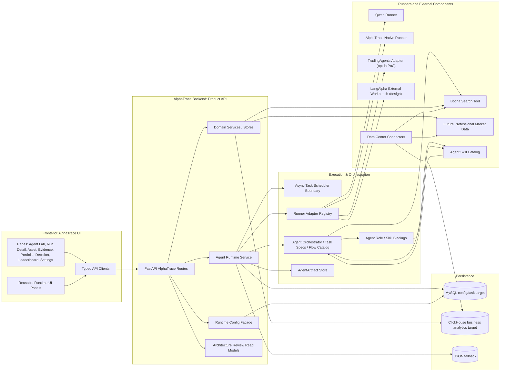
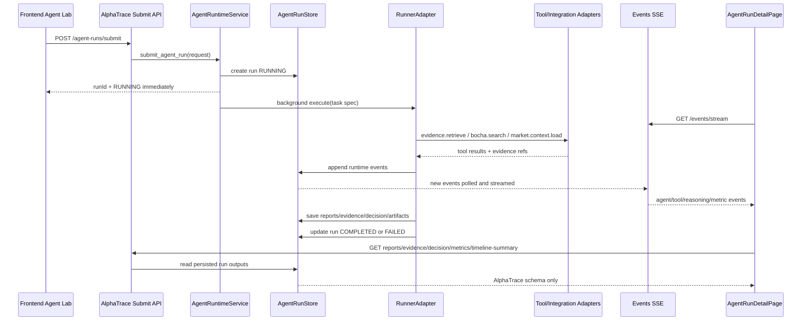
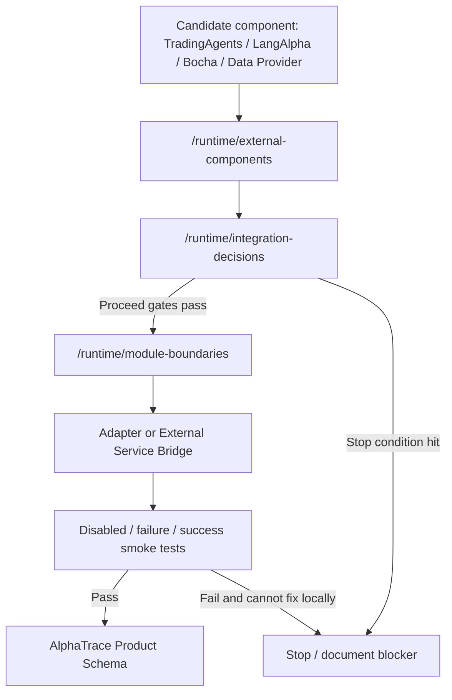
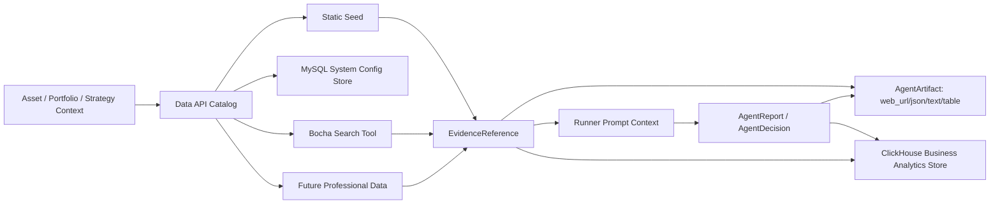
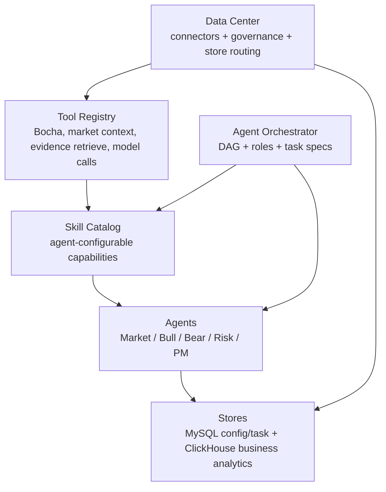
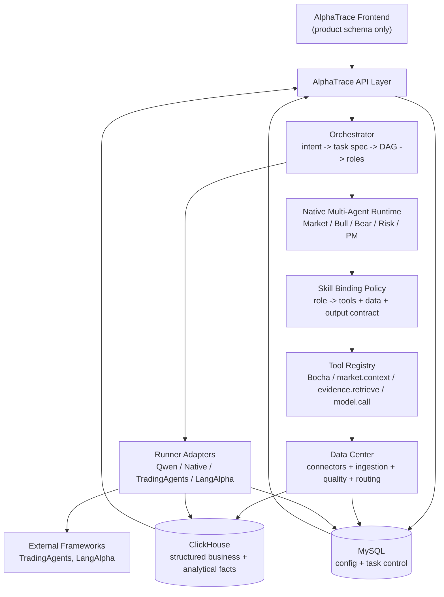
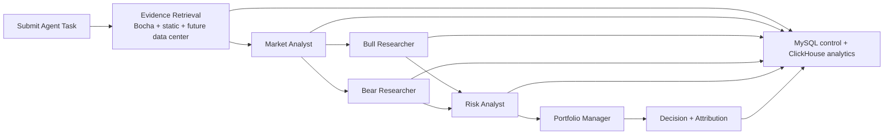

# AlphaTrace Architecture Overview

This document is the compact architecture map for the current AlphaTrace refactor line. It complements `docs/ARCHITECTURE.md` with an implementation-oriented directory structure and data-flow diagrams.

## 1. Current Directory Structure

```text
Hyper-Alpha-Arena/
  backend/
    api/
      alpha_trace_*_routes.py              # AlphaTrace REST/SSE product APIs
      config_routes.py                     # Runtime/key configuration facade used by Settings
    schemas/
      alpha_trace_*.py                     # Frontend-safe AlphaTrace schemas
    services/
      alpha_trace_agent_runtime_service.py # AgentRun submit/detail/events/reports/evidence/decision orchestration
      agent_runners/                       # Runner adapters: stub, qwen, alphatrace_native, tradingagents, langalpha stub
      agent_orchestrator/                  # Runner-neutral plans, flows, task specs, adapter matrix
      agent_runtime_store/                 # AgentRun persistence abstraction: MySQL config/task target + JSON fallback
      async_tasks/                         # Scheduler-neutral async task abstraction and task snapshots
      agent_artifacts/                     # AgentArtifact store, catalog, URL/tool result mappers
      agent_runtime_metrics.py             # Single-run metrics snapshot read model
      agent_runtime_timeline.py            # Compacted timeline summary read model
      runtime_config/                      # Sanitized Qwen/Bocha/TradingAgents/LangAlpha config facade
      runtime_readiness.py                 # Consolidated runtime readiness summary
      model_providers/                     # Model provider catalog and runtime descriptors
      integration_adapters/                # Qwen/Bocha/tool/professional-data/LangAlpha adapter boundary
      data_api/                            # AlphaTrace data API resource/provider catalog
      data_center_catalog.py               # Data Center connector/governance/store-routing catalog
      agent_skill_catalog.py               # Agent-configurable skill descriptor catalog
      agent_skill_bindings.py              # Agent role -> skill/tool/output binding matrix
      clickhouse_schema_catalog.py         # Planned ClickHouse business analytics schema catalog
      evidence_retrieval/                  # Static + Bocha evidence retrieval and mapping
      asset_store/                         # Asset domain store, static seed today + ClickHouse target
      strategy_store/                      # Strategy domain store
      portfolio_store/                     # Portfolio domain store
      decision_store/                      # Decision extraction/store from AgentRun + static fallback
      leaderboard_store/                   # Runtime quality leaderboard
      backend_module_boundaries.py         # AlphaTrace-owned vs legacy vs external boundaries
      external_component_catalog.py        # TradingAgents/LangAlpha/Bocha/provider component catalog
      integration_decision_guide.py        # Proceed/stop gates for external integrations
      architecture_index.py                # Product-owned architecture read model
      architecture_review_bundle.py        # One-call architecture review bundle
    integrations/
      bocha/                               # Bocha client/schema/mapper, backend-only key usage
    database/                              # Existing DB/session/model infrastructure; MySQL config/task direction
    runtime_data/                          # Local fallback JSON/runtime artifacts; not production persistence
  frontend/
    app/
      entities/
        runtime/api.ts                     # Typed runtime/architecture/readiness/artifact contracts
        data-source/api.ts                 # Data source + Data API catalog contracts
        agent/                             # AgentRun submit/detail/events domain client
      shared/ui/
        RuntimeReadinessPanel.tsx
        DataApiCatalogPanel.tsx
        DataCenterPanel.tsx
        AgentSkillPanel.tsx
        AgentSkillBindingPanel.tsx
        ClickHouseSchemaPanel.tsx
        ModuleBoundaryPanel.tsx
        ExternalComponentPanel.tsx
        IntegrationDecisionPanel.tsx
        ArchitectureReviewPanel.tsx
        AgentArtifactPreviewCard.tsx
      pages/                               # AlphaTrace and legacy app pages; current refactor avoids page wiring unless scoped
      shared/api/endpoints.ts              # Frontend endpoint constants
  docs/
    PROJECT_SPEC.md
    EXECUTION_PLAN.md
    IMPLEMENTATION_LOG.md
    VALIDATION.md
    ARCHITECTURE.md
    ARCHITECTURE_OVERVIEW.md               # This file
  scripts/alphatrace/
    smoke_backend_abstractions.ps1
    smoke_abstraction_endpoints.ps1
```

## 2. Module Boundary Summary

| Boundary | Current Role | Refactor Rule |
|---|---|---|
| AlphaTrace API Layer | Owns frontend-facing REST/SSE product contracts. | Frontend consumes AlphaTrace schemas only. |
| Domain Stores | Asset/Evidence/Strategy/Portfolio/Decision/Leaderboard product data. | Static seed is fallback; ClickHouse is target structured business persistence. |
| Data Center | Internal/external connector governance and store routing. | Bocha is one tool input; ClickHouse is the business analytics target. |
| Agent Skills | Product-level role/skill/tool/output binding contracts. | Runners implement skills but do not own product contracts. |
| Agent Runtime | Submit, background execution, events, SSE, reports, evidence, decision, artifacts. | Product persistence remains AlphaTrace-owned. |
| Runner Adapters | Stub/Qwen/Native/TradingAgents/LangAlpha runner boundary. | Runners execute and map back to AlphaTrace schema; they do not own product models. |
| Integration Adapters | Qwen/Bocha/tools/professional data/LangAlpha external bridge. | Secrets are backend-only; diagnostics are sanitized. |
| Async Task Layer | Scheduler-neutral task specs/snapshots. | Future worker/subprocess/distributed scheduling plugs in here. |
| Legacy Crypto/Trading | Existing BTC/Hyperliquid/Binance/trading semantics. | Keep available for old pages; do not use as AlphaTrace ETF/fund/index data base. |
| TradingAgents | Optional LangGraph runner PoC. | Adapter only; no internal state exposed. |
| LangAlpha | Architecture reference / future external workbench bridge. | External service bridge only; no server embedding in AlphaTrace. |

## 3. Overall Architecture



## 4. Agent Runtime Data Flow



## 5. External Component Decision Flow



## 6. Data API and Evidence Flow



## 7. Current Review Endpoints

| Endpoint | Purpose |
|---|---|
| `/api/alpha-trace/agent-runs/runtime/architecture` | High-level architecture index. |
| `/api/alpha-trace/agent-runs/runtime/architecture-review` | One-call architecture review bundle. |
| `/api/alpha-trace/agent-runs/runtime/module-boundaries` | Backend module boundary catalog. |
| `/api/alpha-trace/agent-runs/runtime/external-components` | External component catalog. |
| `/api/alpha-trace/agent-runs/runtime/integration-decisions` | Proceed/stop decision guide. |
| `/api/alpha-trace/agent-runs/runtime/data-center` | Data Center connector/governance/store-routing catalog. |
| `/api/alpha-trace/agent-runs/runtime/skills` | Agent skill catalog for agent-configurable tool/data/model/output bindings. |
| `/api/alpha-trace/agent-runs/runtime/agent-skill-bindings` | Agent-role to skill/tool/output-contract binding matrix. |
| `/api/alpha-trace/agent-runs/runtime/readiness` | Runtime readiness summary. |
| `/api/alpha-trace/data-sources/api-catalog` | Data API resource/provider catalog. |
| `/api/alpha-trace/agent-runs/runtime/artifacts/catalog` | AgentArtifact preview/source policy catalog. |

## 8. Refactor Priorities After This Baseline

1. Wire the reusable architecture panels into a dedicated diagnostics/settings page after isolating current dirty frontend page work.
2. Harden async task status machine and reduce write amplification from metric events.
3. Promote task-level metrics snapshots over raw metric timelines for UI status.
4. Stabilize AlphaTrace Native runner as product path.
5. Continue TradingAgents PoC only through `TradingAgentsRunnerAdapter` and with clear disabled/import/failure states.
6. Treat LangAlpha as external service/design reference until worker/artifact contracts are stable.
7. Move system config/task control to MySQL and structured runtime/domain analytics to ClickHouse, with JSON/static fallback preserved for local development.


## 9. Data Center, Tool, Skill, and Multi-Agent Control Planes



Rule: Bocha is a tool input to Evidence Retrieval. It is not the durable business data layer. Structured business outputs go to ClickHouse after mapping into AlphaTrace schemas; runtime/config/control state goes to MySQL.

## 10. Target Backend Directory Structure

The current codebase is transitional: AlphaTrace product modules live inside the existing Hyper-Alpha-Arena backend while legacy crypto/trading modules remain available for old pages. The target commercial backend should gradually move toward the following ownership structure.

```text
backend/
  api/
    alpha_trace/
      assets.py
      evidence.py
      strategies.py
      portfolios.py
      decisions.py
      leaderboard.py
      data_sources.py
      agent_runs.py
      runtime_diagnostics.py
      settings.py
  domains/
    asset/
    evidence/
    strategy/
    portfolio/
    decision/
    leaderboard/
    data_source/
    market_data/
  runtime/
    agent_run_service.py
    runtime_event_service.py
    sse_stream_service.py
    task_status_machine.py
    async_scheduler.py
    orchestrator/
      task_spec.py
      dag.py
      role_binding.py
      skill_binding.py
  runners/
    base.py
    registry.py
    stub.py
    qwen.py
    alphatrace_native.py
    tradingagents_adapter.py
    langalpha_adapter.py
  tools/
    registry.py
    bocha_search.py
    evidence_retrieve.py
    market_context.py
    model_call.py
  skills/
    catalog.py
    bindings.py
    policies.py
  data_center/
    catalog.py
    connector_registry.py
    ingestion_jobs.py
    store_routing.py
    quality_policy.py
  integrations/
    qwen/
    bocha/
    tradingagents/
    langalpha/
    professional_market_data/
  infrastructure/
    mysql/
      system_config_store.py
      task_control_store.py
    clickhouse/
      market_fact_store.py
      runtime_projection_store.py
      evidence_fact_store.py
    object_storage/
    logging/
    audit/
  legacy/
    crypto/
    exchange/
    trading/
```

Migration rule: do not physically move modules until the target boundary is stable. First add thin facades and read models, then move one domain at a time behind unchanged AlphaTrace API contracts.

## 11. Store Ownership and Data Routing

| Data class | Canonical owner | Store target | Notes |
|---|---|---|---|
| API keys, provider settings, module presets | Settings / Runtime Config | MySQL | Store encrypted/sanitized config metadata only; never expose raw keys to frontend. |
| Task status, cancellation, retry, run control | Agent Runtime | MySQL | MySQL is the control-plane store. JSON remains local fallback only. |
| Runtime events for analytics | Agent Runtime projection | ClickHouse | Keep raw control state in MySQL; project analytical facts to ClickHouse. |
| Reports, evidence refs, decisions for analytics | Runtime/domain projection | ClickHouse | Projection must be replayable from AlphaTrace schema. |
| ETF/fund/index market facts and file imports | Data Center / Market Data | ClickHouse | Structured business facts, partitioned by date/import batch. |
| Bocha search results | Tool output -> Evidence | MySQL metadata + ClickHouse analytical projection | Bocha is a tool. Its URL/title/summary become evidence metadata; it is not the business store. |
| Agent skills and role bindings | Orchestrator / Skill Catalog | MySQL config later, static catalog now | Skills define allowed tool/data/model/output contracts per role. |
| TradingAgents internal checkpoint | TradingAgents adapter only | Runner-private, not product persistence | Never expose checkpoint as frontend schema. |
| LangAlpha workspace/thread state | LangAlpha external bridge only | External service-private | Map outputs back into AlphaTrace AgentRun schema. |

## 12. Commercial Backend Data Flow



Key constraint: the frontend never receives TradingAgents or LangAlpha internal state. Every external runtime must be normalized into AlphaTrace `AgentRun`, `AgentRuntimeEvent`, `AgentReport`, `EvidenceReference`, `AgentDecision`, and analytical projections.

## 13. Native Multi-Agent Product Path



Product direction:

1. `alphatrace_native` is the recommended product runner path.
2. TradingAgents is used to learn LangGraph-style flow, debate, and risk team patterns, but it remains an opt-in adapter.
3. LangAlpha is used to learn product workbench patterns: workspace, tasks, tools, background execution, event buffers, model/provider configuration, and BYOK.
4. Skills are product-level capabilities that can be assigned to agent roles; they are not hard-coded to one runner.

## 14. Integration Positioning

| Component | Best role in AlphaTrace | Do not do |
|---|---|---|
| Qwen Runner | Reliable model execution backend for Native and direct Qwen tasks. | Do not let Qwen markdown shape own product data contracts. |
| AlphaTrace Native Runner | Main product multi-agent DAG with configurable skills/tools. | Do not rely on simulated UI-only DAG once native orchestration is available. |
| TradingAgents | Optional LangGraph runner adapter and design reference for debate/risk flow. | Do not replace AlphaTrace backend, copy code, or expose internal state. |
| LangAlpha | Architecture reference and possible external research-service adapter. | Do not embed the full LangAlpha server into AlphaTrace backend. |
| Bocha | Backend tool for external web evidence retrieval. | Do not store Bocha as opaque untraceable text; persist URL/title/summary/source metadata. |
| ClickHouse | Structured facts, analytics, projections, leaderboard/quality metrics. | Do not use ClickHouse for secrets or task-control state. |
| MySQL | Config, task control, credentials metadata, lightweight product settings. | Do not use MySQL as the main analytical fact store once ClickHouse path exists. |
