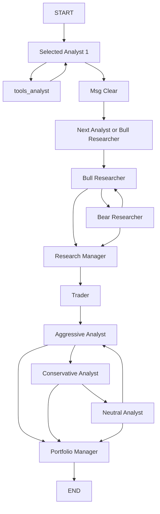

# 24 TradingAgents Runtime Deconstruction

日期：2026-05-01

目标：解构 TradingAgents 项目的 runtime 架构，为 AlphaTrace 后续 `TradingAgentsRunnerAdapter` 设计提供输入。

本文件只分析本地代码，不复制 TradingAgents 代码，不接入 TradingAgents。

## 1. 总体判断

TradingAgents 不是产品型后端。它是一个多 Agent 投研 / 交易研究框架，核心是：

1. LangGraph workflow。
2. 多 Agent 团队。
3. Tool nodes。
4. LLM provider abstraction。
5. Checkpoint。
6. Memory log。
7. CLI 展示。

它适合承担 AlphaTrace 的 Runner Runtime，而不是替代 AlphaTrace 主后端。

## 2. 项目目录结构

主要目录：

1. `tradingagents/agents`
2. `tradingagents/agents/analysts`
3. `tradingagents/agents/researchers`
4. `tradingagents/agents/managers`
5. `tradingagents/agents/risk_mgmt`
6. `tradingagents/agents/trader`
7. `tradingagents/agents/utils`
8. `tradingagents/dataflows`
9. `tradingagents/graph`
10. `tradingagents/llm_clients`
11. `cli`
12. `tests`

项目不是 FastAPI app，没有产品 REST API，没有 AlphaTrace 的资产、证据、组合、决策归因 API。

## 3. TradingAgentsGraph

核心文件：

1. `tradingagents/graph/trading_graph.py`
2. `tradingagents/graph/setup.py`
3. `tradingagents/graph/propagation.py`
4. `tradingagents/graph/conditional_logic.py`
5. `tradingagents/graph/checkpointer.py`
6. `tradingagents/graph/reflection.py`
7. `tradingagents/graph/signal_processing.py`

`TradingAgentsGraph` 负责：

1. 读取 config。
2. 初始化 LLM client。
3. 创建 tool nodes。
4. 创建 conditional logic。
5. 通过 `GraphSetup` 组装 LangGraph。
6. 通过 `Propagator` 初始化 state。
7. 执行 `graph.invoke` 或 `graph.stream`。
8. 记录 final state。
9. 写 memory log。
10. 返回 final decision signal。

## 4. LangGraph 使用方式

`GraphSetup.setup_graph()` 使用 `StateGraph(AgentState)`。

节点包括：

1. selected analyst nodes。
2. tool nodes。
3. Bull Researcher。
4. Bear Researcher。
5. Research Manager。
6. Trader。
7. Aggressive Analyst。
8. Conservative Analyst。
9. Neutral Analyst。
10. Portfolio Manager。

流程图：

注意：

1. Analyst Team 是按 selected analysts 顺序串行执行。
2. Bull / Bear 是 debate loop，不是天然并行。
3. Risk team 是 aggressive / conservative / neutral 轮转讨论，不是天然并行。
4. LangGraph 支持 graph stream，但当前 CLI 主要消费状态 chunk。

## 5. Agent State / Graph State

`AgentState` 继承 `MessagesState`，核心字段包括：

1. `company_of_interest`
2. `trade_date`
3. `sender`
4. `market_report`
5. `sentiment_report`
6. `news_report`
7. `fundamentals_report`
8. `investment_debate_state`
9. `investment_plan`
10. `trader_investment_plan`
11. `risk_debate_state`
12. `final_trade_decision`
13. `past_context`

`InvestDebateState`：

1. `bull_history`
2. `bear_history`
3. `history`
4. `current_response`
5. `judge_decision`
6. `count`

`RiskDebateState`：

1. `aggressive_history`
2. `conservative_history`
3. `neutral_history`
4. `history`
5. `latest_speaker`
6. `current_*_response`
7. `judge_decision`
8. `count`

为什么不应直接暴露给 AlphaTrace 前端：

1. 字段是 runtime 内部状态，不是稳定产品 API。
2. 命名偏 stock / trading。
3. 缺少 AlphaTrace 的 Evidence / Portfolio / Decision Attribution 结构。
4. 状态包含 prompt 中间产物和消息对象，不适合直接持久化为商业数据模型。
5. 一旦 TradingAgents 内部版本升级，前端会被破坏。

## 6. Analyst Team

TradingAgents 支持 selected analysts：

1. Market Analyst
2. Social Analyst
3. News Analyst
4. Fundamentals Analyst

### Market Analyst

文件：`agents/analysts/market_analyst.py`

特点：

1. 使用 `get_stock_data` 和 `get_indicators`。
2. 要求选择最多 8 个技术指标。
3. 输出市场趋势和技术分析报告。
4. prompt 要求附带 markdown table。

### Fundamentals Analyst

文件：`agents/analysts/fundamentals_analyst.py`

用途：

1. 公司基本面。
2. 财务报表。
3. 估值和经营质量。

### News / Sentiment Analyst

文件：

1. `news_analyst.py`
2. `social_media_analyst.py`

用途：

1. 新闻。
2. 全球事件。
3. 社交情绪。

对 AlphaTrace 的启发：

1. Analyst Team 可映射到 Asset Research / Evidence Retrieval。
2. 每个 analyst report 可映射为 `AgentReport`。
3. tool call 可映射为 `AgentRuntimeEvent(type=tool.called/tool.result)`。

## 7. Research Team

### Bull Researcher

文件：`agents/researchers/bull_researcher.py`

输入：

1. market report
2. sentiment report
3. news report
4. fundamentals report
5. conversation history
6. last bear argument

输出：

1. bull argument。
2. 更新 `investment_debate_state`。

### Bear Researcher

文件：`agents/researchers/bear_researcher.py`

输入与 Bull 类似，但立场相反。

### Research Manager

作用：

1. 终止 Bull / Bear debate。
2. 形成 investment plan。

对 AlphaTrace 的启发：

1. Bull / Bear debate 是可借鉴核心。
2. AlphaTrace 前端当前的 Debate Panel 可以映射该能力。
3. 但 AlphaTrace 不应直接使用 `investment_debate_state`，应映射为 `AgentReport`、`debate.message` 和 `AgentDecision` 辅助字段。

## 8. Trader / Strategy 决策逻辑

Trader 负责基于 research manager 的 investment plan 生成交易计划。

风险：

1. TradingAgents 的 Trader 语义更偏交易执行。
2. AlphaTrace 应改为“配置建议 / 调仓建议 / 投研建议”。
3. 交易执行能力应后置，不应作为 AlphaTrace MVP 主能力。

## 9. Risk Management Team

Risk team 包括：

1. Aggressive Analyst
2. Conservative Analyst
3. Neutral Analyst

由 `conditional_logic.should_continue_risk_analysis()` 控制轮转。

对 AlphaTrace 的启发：

1. 可以借鉴多风险视角。
2. 可映射为 `Risk Review`、`risk.warning`、`AgentReport`。
3. 不建议直接暴露 aggressive/conservative/neutral 作为产品 UI 默认结构，除非后续产品确实需要。

## 10. Portfolio Manager / Final Decision

文件：`agents/managers/portfolio_manager.py`

特点：

1. 综合 Research Manager、Trader、Risk Debate。
2. 使用 structured output，失败时 fallback free text。
3. 输出 rating scale：Buy / Overweight / Hold / Underweight / Sell。
4. 渲染回 markdown 存入 `final_trade_decision`。

对 AlphaTrace 的映射：

1. `final_trade_decision` -> `AgentDecision.thesis`
2. rating -> `AgentDecision.action`
3. evidence phrases -> `EvidenceReference` 引用需要后处理。
4. risk debate history -> `AgentReport` 或 `AgentDecision.risks`

## 11. Tool Nodes

`TradingAgentsGraph._create_tool_nodes()` 创建：

1. market tools：
   - `get_stock_data`
   - `get_indicators`
2. social tools：
   - `get_news`
3. news tools：
   - `get_news`
   - `get_global_news`
   - `get_insider_transactions`
4. fundamentals tools：
   - `get_fundamentals`
   - `get_balance_sheet`
   - `get_cashflow`
   - `get_income_statement`

工具系统优点：

1. LangGraph tool node 边界清晰。
2. LLM 可以决定是否继续调用工具。
3. 工具调用状态可以映射为 AlphaTrace runtime events。

风险：

1. 工具默认面向股票 ticker。
2. 数据源授权和稳定性需商业化审查。
3. ETF / 基金 / 期货需要新的工具适配。

## 12. Data Source Tools

已发现 dataflows：

1. `alpha_vantage_common.py`
2. `alpha_vantage_fundamentals.py`
3. `alpha_vantage_indicator.py`
4. `alpha_vantage_news.py`
5. `alpha_vantage_stock.py`
6. `alpha_vantage.py`
7. `y_finance.py`
8. `yfinance_news.py`
9. `stockstats_utils.py`
10. `interface.py`

默认 config：

1. core stock APIs：`yfinance`
2. technical indicators：`yfinance`
3. fundamental data：`yfinance`
4. news data：`yfinance`

对 AlphaTrace：

1. 可作为外部数据源 connector 的参考。
2. 不应直接作为 Evidence Store 的唯一数据源。
3. 所有数据进入 AlphaTrace 应先进入 Evidence / DataSource 模型。

## 13. Model Provider Config

TradingAgents provider：

1. OpenAI
2. xAI
3. DeepSeek
4. Qwen
5. GLM
6. Ollama
7. OpenRouter
8. Anthropic
9. Google
10. Azure

Qwen 默认在 `openai_client.py` 中使用：

1. base URL：`https://dashscope-intl.aliyuncs.com/compatible-mode/v1`
2. env：`DASHSCOPE_API_KEY`

AlphaTrace 当前 Hyper AI provider 使用：

1. base URL：`https://dashscope.aliyuncs.com/compatible-mode/v1`
2. 可从后端 profile encrypted key 读取。

建议：

1. AlphaTrace 应有自己的 `ModelConfigService`。
2. TradingAgentsAdapter 调用时将 AlphaTrace model config 转成 TradingAgents config。
3. 不让 TradingAgents 直接读取前端配置。

## 14. Checkpoint / Memory / Logs

Checkpoint：

1. `graph/checkpointer.py`
2. 使用 `langgraph.checkpoint.sqlite.SqliteSaver`
3. per-ticker SQLite DB
4. `thread_id(ticker, date)` 生成 deterministic thread id

Memory：

1. `agents/utils/memory.py`
2. append-only markdown decision log
3. 跟踪 pending / resolved decision
4. 后续同 ticker run 注入 past context

Logs：

1. `TradingAgentsGraph._log_state()`
2. 将 final state 写 JSON 文件
3. 路径：`results_dir / ticker / TradingAgentsStrategy_logs`

为什么 checkpoint 不等于 AlphaTrace 产品持久化：

1. checkpoint 是 runtime resume 状态。
2. markdown memory 是内部反思日志。
3. JSON state log 是运行产物，不是 API schema。
4. AlphaTrace 需要可查询、可授权、可审计、可关联 Evidence/Decision/Portfolio 的产品数据。

## 15. CLI Flow

`cli/main.py` 负责：

1. 交互式选择 ticker。
2. 选择 analysis date。
3. 选择 LLM provider。
4. 选择 analysts。
5. 展示 agent status。
6. 展示 tool calls。
7. 展示 current report / final report。

CLI 中 `MessageBuffer` 已有：

1. fixed teams。
2. analyst mapping。
3. report section mapping。
4. agent status。
5. current report。
6. final report。

对 AlphaTrace 的启发：

1. AgentRunDetail 进度 UI 可继续借鉴。
2. 但 CLI UI 代码不应直接复制到前端。

## 16. 输入输出结构

输入：

1. `company_name` / ticker
2. `trade_date`
3. selected analysts
4. model config
5. data vendor config
6. debate rounds
7. risk discussion rounds

输出：

1. full final state
2. processed final decision signal
3. state JSON log
4. memory log entry

AlphaTrace 需要的输入输出：

1. assetId / portfolioId / strategyId
2. taskType
3. question
4. horizon
5. riskPreference
6. evidenceScope
7. AgentRun
8. RuntimeEvents
9. Reports
10. EvidenceReferences
11. Decision

因此必须做 mapper。

## 17. Stream / Progress 映射

TradingAgents 可通过 `graph.stream(init_agent_state, **args)` 获得 chunk。

可映射为：

1. node enter -> `agent.started`
2. tool call -> `tool.called`
3. tool result -> `tool.result`
4. report field update -> `report.generated`
5. debate state update -> `debate.message`
6. risk debate update -> `risk.warning` 或 `debate.message`
7. final decision -> `decision.updated`
8. graph end -> `agent.run.completed`

注意：

1. LangGraph chunk 不是 AlphaTrace RuntimeEvent。
2. Adapter 必须做稳定转换。
3. 前端只消费 AlphaTrace RuntimeEvent。

## 18. 可借鉴能力

适合借鉴：

1. LangGraph DAG。
2. Analyst / Research / Risk / Portfolio team 分层。
3. Bull / Bear debate。
4. Risk debate。
5. Tool node pattern。
6. Checkpoint / resume。
7. Structured output fallback。
8. Memory / reflection。
9. CLI progress display 思路。

## 19. 不建议复制能力

不建议直接复制：

1. TradingAgents CLI UI。
2. TradingAgents internal state 作为产品 schema。
3. ticker / trade_date 单一输入模型。
4. final transaction proposal 文案。
5. yfinance / Alpha Vantage 工具直接进入产品 API。
6. checkpoint SQLite 作为产品 DB。
7. memory markdown log 作为决策数据库。

## 20. TradingAgents -> AlphaTrace 映射建议

| TradingAgents | AlphaTrace |
|---|---|
| `TradingAgentsGraph` | `TradingAgentsRunnerAdapter` 内部引擎 |
| `AgentState` | adapter 内部 state，不外露 |
| `market_report` | `AgentReport(title=Market Analysis)` |
| `sentiment_report` | `AgentReport(title=Sentiment Analysis)` |
| `news_report` | `AgentReport(title=News Analysis)` |
| `fundamentals_report` | `AgentReport(title=Fundamentals Analysis)` |
| `investment_debate_state.bull_history` | `debate.message` + Bull report |
| `investment_debate_state.bear_history` | `debate.message` + Bear report |
| `investment_plan` | Research Manager report |
| `trader_investment_plan` | Strategy / allocation plan report |
| `risk_debate_state` | Risk reports / risk warnings |
| `final_trade_decision` | `AgentDecision` |
| tool calls | `AgentRuntimeEvent(type=tool.called/tool.result)` |
| checkpoint | internal runner resume only |
| memory log | optional source for future model memory, not product DB |

