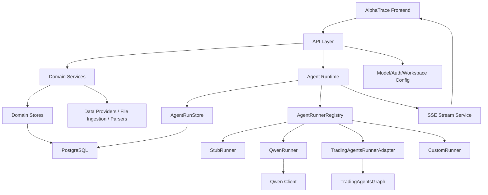

# 25 AlphaTrace Target Backend Architecture

日期：2026-05-01

状态更新：2026-05-05

本文写于当前存储方向调整之前。下文所有 PostgreSQL 相关内容保留为历史设计上下文，不再作为当前执行目标。当前 canonical 方向是：

1. MySQL 8.0+：系统配置、密钥元数据、任务控制、轻量控制面状态。
2. ClickHouse：结构化业务事实、行情数据、Runtime/Report/Evidence/Decision 分析投影、Leaderboard/Quality facts。
3. JSON store：仅作为本地/MVP fallback。

后续执行以 `docs/PROJECT_SPEC.md`、`docs/EXECUTION_PLAN.md`、`docs/VALIDATION.md`、`docs/ARCHITECTURE_OVERVIEW.md` 为准。

目标：定义 AlphaTrace 自有商业化后端目标架构。

## 1. 架构原则

AlphaTrace 后端必须遵循：

1. AlphaTrace 是主产品后端。
2. TradingAgents 是 Runner Adapter，不是主后端。
3. 前端只消费 AlphaTrace schema。
4. Runner 只负责执行，不负责产品数据模型。
5. Evidence 是一等公民。
6. Agent Runtime 是统一执行层。
7. PostgreSQL 是后续产品数据存储目标。
8. 当前 JSON store 是 MVP 过渡方案。
9. 旧 Hyper-Alpha-Arena crypto / exchange / trading 模块归入 Legacy。
10. 新商业化模块不直接暴露 TradingAgents internal state。

## 2. 目标架构图



## 3. 目标目录结构

建议目标目录：

```text
backend/
  api/
    alpha_trace/
      asset_routes.py
      evidence_routes.py
      strategy_routes.py
      portfolio_routes.py
      decision_routes.py
      leaderboard_routes.py
      data_source_routes.py
      model_config_routes.py
      agent_runtime_routes.py
      auth_routes.py
      workspace_routes.py
  domains/
    assets/
      schemas.py
      service.py
      store.py
    evidence/
      schemas.py
      service.py
      store.py
      scoring.py
      citation_validation.py
    strategies/
      schemas.py
      service.py
      store.py
    portfolios/
      schemas.py
      service.py
      store.py
      risk.py
    decisions/
      schemas.py
      service.py
      store.py
    leaderboard/
      service.py
      store.py
    data_sources/
      schemas.py
      service.py
      store.py
  runtime/
    agent_runs/
      schemas.py
      service.py
      store.py
    events/
      schemas.py
      service.py
      sse.py
    registry.py
  runners/
    base.py
    stub_runner.py
    qwen_runner.py
    tradingagents_runner.py
    custom_runner.py
  integrations/
    model_providers/
      qwen_client.py
      openai_compatible.py
    tradingagents/
      adapter.py
      mapper.py
    data_providers/
      market_snapshot.py
      news.py
      macro.py
    ingestion/
      file_import.py
      report_parser.py
  infrastructure/
    db/
      connection.py
      models/
      migrations/
    auth/
    audit/
    config/
    logging/
```

该结构不要求一次性迁移。当前项目可先以增量方式新增 `domains/`、`runtime/`、`runners/`，再逐步从 `services/` 中迁移。

## 4. API Layer

目标 API：

1. Asset routes
2. Evidence routes
3. Strategy routes
4. Portfolio routes
5. Decision routes
6. Leaderboard routes
7. Data source routes
8. Agent runtime routes
9. Model config routes
10. Auth / workspace routes 预留

要求：

1. API 只返回 AlphaTrace schema。
2. 不返回 TradingAgents internal state。
3. 不返回 provider API key。
4. 所有 runner output 必须经过 mapper。
5. 所有 evidence 引用必须可追踪。

## 5. Domain Services

目标服务：

1. `AssetService`
2. `EvidenceService`
3. `StrategyService`
4. `PortfolioService`
5. `DecisionService`
6. `LeaderboardService`
7. `DataSourceService`
8. `ModelConfigService`

职责：

1. 处理领域规则。
2. 组合 store 查询。
3. 做权限过滤。
4. 做 schema mapping。
5. 不直接执行 runner。

## 6. Domain Stores

目标 store：

1. `AssetStore`
2. `EvidenceStore`
3. `StrategyStore`
4. `PortfolioStore`
5. `DecisionStore`
6. `AgentRunStore`
7. `DataSourceStore`

要求：

1. 提供 PostgreSQL 实现。
2. 保留 JSON / memory fallback 用于开发。
3. store 接口稳定，方便测试。
4. DB schema 与 API schema 不强耦合。

## 7. Agent Runtime

目标组件：

1. `AgentRunService`
2. `RuntimeEventService`
3. `SSEStreamService`
4. `AgentRunnerRegistry`
5. `AgentRunnerAdapter`

Agent Runtime 统一负责：

1. submit。
2. status machine。
3. events。
4. reports。
5. evidence refs。
6. decisions。
7. error reason。
8. timeout。
9. cancellation。
10. retry。

Runner 只负责执行。Runner 不直接决定产品 DB 结构。

## 8. Runner Adapters

目标 runner：

1. `StubRunner`
2. `QwenRunner`
3. `TradingAgentsRunnerAdapter`
4. `CustomRunner`

统一接口：

```python
class AgentRunnerAdapter:
    runner_type: str

    def submit(self, request, context):
        ...
```

长期建议：

1. `submit()` 只创建 run 并返回。
2. 执行放入 background worker。
3. runner 通过 context append events / save outputs。
4. runner output 统一映射到 AlphaTrace schema。

## 9. Integrations

目标 integrations：

1. Qwen client。
2. OpenAI-compatible client。
3. TradingAgents adapter。
4. External data providers。
5. File ingestion。
6. Report parsers。

原则：

1. integration 不直接暴露给前端。
2. integration 数据必须进入 DataSource / Evidence。
3. 外部工具调用必须产生日志和 evidence lineage。

## 10. Infrastructure

目标基础设施：

1. PostgreSQL。
2. JSONB payload。
3. object storage optional。
4. logging。
5. audit。
6. workspace / user / permission。
7. config management。
8. secret encryption。

## 11. 核心数据模型草案

### Asset

字段：

1. `asset_id`
2. `symbol`
3. `name`
4. `asset_type`
5. `market`
6. `currency`
7. `tags`
8. `description`
9. `risk_level`
10. `liquidity_level`
11. `metadata_json`

### EvidenceItem

字段：

1. `evidence_id`
2. `title`
3. `source_name`
4. `source_type`
5. `evidence_type`
6. `published_at`
7. `collected_at`
8. `quality_score`
9. `reliability_score`
10. `summary`
11. `url`
12. `content_hash`
13. `payload_json`

### Strategy

字段：

1. `strategy_id`
2. `name`
3. `strategy_type`
4. `style`
5. `status`
6. `asset_types`
7. `rules_json`
8. `signals_json`
9. `risk_controls_json`
10. `backtest_summary_json`

### Portfolio

字段：

1. `portfolio_id`
2. `workspace_id`
3. `name`
4. `objective`
5. `risk_level`
6. `status`
7. `base_currency`
8. `total_value`
9. `risk_metrics_json`

### Position

字段：

1. `position_id`
2. `portfolio_id`
3. `asset_id`
4. `weight`
5. `target_weight`
6. `market_value`
7. `risk_contribution`
8. `payload_json`

### Decision

字段：

1. `decision_id`
2. `run_id`
3. `portfolio_id`
4. `asset_id`
5. `strategy_id`
6. `action`
7. `confidence`
8. `horizon`
9. `thesis`
10. `risks_json`
11. `watch_indicators_json`

### AgentRun

字段：

1. `run_id`
2. `workspace_id`
3. `runner_type`
4. `task_type`
5. `status`
6. `asset_id`
7. `portfolio_id`
8. `strategy_id`
9. `question`
10. `horizon`
11. `risk_preference`
12. `model_provider`
13. `model_name`
14. `error_message`
15. `started_at`
16. `completed_at`
17. `payload_json`

### AgentRuntimeEvent

字段：

1. `event_id`
2. `run_id`
3. `sequence`
4. `event_type`
5. `timestamp`
6. `agent_name`
7. `team`
8. `step_id`
9. `payload_json`

### AgentReport

字段：

1. `report_id`
2. `run_id`
3. `agent_name`
4. `report_type`
5. `title`
6. `summary`
7. `content`
8. `payload_json`

### EvidenceReference

字段：

1. `id`
2. `run_id`
3. `evidence_id`
4. `decision_id`
5. `reference_type`
6. `quote`
7. `confidence`
8. `payload_json`

### DataSource

字段：

1. `data_source_id`
2. `name`
3. `source_type`
4. `status`
5. `quality_score`
6. `reliability_score`
7. `last_sync_at`
8. `sync_config_json`
9. `payload_json`

### ModelProviderConfig

字段：

1. `config_id`
2. `workspace_id`
3. `provider`
4. `model`
5. `base_url`
6. `api_key_encrypted`
7. `api_format`
8. `enabled`
9. `payload_json`

### User / Workspace / Role 预留

字段：

1. `user_id`
2. `workspace_id`
3. `role`
4. `permissions_json`
5. `created_at`
6. `updated_at`

## 12. PostgreSQL 表设计草案

### `alpha_trace_agent_runs`

主要字段：

1. `run_id text primary key`
2. `workspace_id text index`
3. `runner_type text index`
4. `task_type text index`
5. `status text index`
6. `asset_id text index null`
7. `portfolio_id text index null`
8. `strategy_id text index null`
9. `question text`
10. `horizon text`
11. `risk_preference text`
12. `model_provider text`
13. `model_name text`
14. `error_message text`
15. `started_at timestamptz`
16. `completed_at timestamptz`
17. `created_at timestamptz`
18. `updated_at timestamptz`
19. `payload_json jsonb`

索引：

1. `(workspace_id, created_at desc)`
2. `(status, created_at desc)`
3. `(asset_id, created_at desc)`
4. `(portfolio_id, created_at desc)`
5. GIN on `payload_json`

### `alpha_trace_runtime_events`

字段：

1. `event_id text primary key`
2. `run_id text references alpha_trace_agent_runs(run_id)`
3. `sequence int`
4. `event_type text`
5. `timestamp timestamptz`
6. `agent_name text`
7. `team text`
8. `step_id text`
9. `payload_json jsonb`

索引：

1. unique `(run_id, sequence)`
2. `(run_id, timestamp)`
3. `(event_type)`
4. GIN on `payload_json`

### `alpha_trace_agent_reports`

字段：

1. `report_id text primary key`
2. `run_id text references alpha_trace_agent_runs(run_id)`
3. `agent_name text`
4. `report_type text`
5. `title text`
6. `summary text`
7. `content text`
8. `created_at timestamptz`
9. `payload_json jsonb`

索引：

1. `(run_id, created_at)`
2. `(report_type)`

### `alpha_trace_evidence_refs`

字段：

1. `id bigserial primary key`
2. `run_id text`
3. `decision_id text`
4. `evidence_id text`
5. `reference_type text`
6. `quote text`
7. `confidence numeric`
8. `payload_json jsonb`

索引：

1. `(run_id)`
2. `(decision_id)`
3. `(evidence_id)`

### `alpha_trace_decisions`

字段：

1. `decision_id text primary key`
2. `run_id text unique`
3. `workspace_id text`
4. `asset_id text`
5. `portfolio_id text`
6. `strategy_id text`
7. `action text`
8. `confidence numeric`
9. `horizon text`
10. `summary text`
11. `thesis text`
12. `risks_json jsonb`
13. `watch_indicators_json jsonb`
14. `payload_json jsonb`
15. `created_at timestamptz`

索引：

1. `(workspace_id, created_at desc)`
2. `(asset_id)`
3. `(portfolio_id)`
4. `(action)`

### `alpha_trace_assets`

字段：

1. `asset_id text primary key`
2. `symbol text index`
3. `name text`
4. `asset_type text index`
5. `market text index`
6. `currency text`
7. `tags_json jsonb`
8. `description text`
9. `risk_level text`
10. `liquidity_level text`
11. `metrics_json jsonb`
12. `profile_json jsonb`

索引：

1. `(asset_type, market)`
2. GIN on `tags_json`
3. full text index on `symbol/name/description` 可选

### `alpha_trace_evidence_items`

字段：

1. `evidence_id text primary key`
2. `title text`
3. `source_name text`
4. `source_type text`
5. `evidence_type text`
6. `published_at timestamptz`
7. `collected_at timestamptz`
8. `quality_score numeric`
9. `reliability_score numeric`
10. `summary text`
11. `content text`
12. `url text`
13. `content_hash text`
14. `related_asset_ids_json jsonb`
15. `extracted_fields_json jsonb`
16. `payload_json jsonb`

索引：

1. `(evidence_type)`
2. `(source_name)`
3. `(published_at desc)`
4. GIN on `related_asset_ids_json`
5. GIN on `payload_json`

### `alpha_trace_strategies`

字段：

1. `strategy_id text primary key`
2. `name text`
3. `strategy_type text index`
4. `style text index`
5. `status text index`
6. `asset_types_json jsonb`
7. `related_asset_ids_json jsonb`
8. `rules_json jsonb`
9. `signals_json jsonb`
10. `risk_controls_json jsonb`
11. `backtest_summary_json jsonb`
12. `payload_json jsonb`

索引：

1. `(strategy_type, status)`
2. GIN on `asset_types_json`
3. GIN on `related_asset_ids_json`

### `alpha_trace_portfolios`

字段：

1. `portfolio_id text primary key`
2. `workspace_id text index`
3. `name text`
4. `objective text`
5. `risk_level text index`
6. `status text index`
7. `base_currency text`
8. `total_value numeric`
9. `risk_metrics_json jsonb`
10. `payload_json jsonb`

索引：

1. `(workspace_id, status)`
2. `(risk_level)`

### `alpha_trace_data_sources`

字段：

1. `data_source_id text primary key`
2. `name text`
3. `source_type text`
4. `status text`
5. `quality_score numeric`
6. `reliability_score numeric`
7. `last_sync_at timestamptz`
8. `sync_config_json jsonb`
9. `payload_json jsonb`

索引：

1. `(source_type, status)`
2. `(last_sync_at desc)`

### `alpha_trace_model_configs`

字段：

1. `config_id text primary key`
2. `workspace_id text index`
3. `provider text`
4. `model text`
5. `base_url text`
6. `api_key_encrypted text`
7. `api_format text`
8. `enabled boolean`
9. `payload_json jsonb`

索引：

1. `(workspace_id, enabled)`
2. `(provider, model)`

## 13. TradingAgents checkpoint 不等于产品持久化

原因：

1. checkpoint 是 LangGraph resume 机制。
2. checkpoint 存的是内部 state，不是稳定 API。
3. checkpoint 不包含 AlphaTrace 的权限、workspace、Evidence lineage。
4. checkpoint 不适合前端查询和审计。
5. checkpoint 会随 TradingAgents 内部版本变化。

AlphaTrace 必须保存自己的：

1. AgentRun。
2. RuntimeEvents。
3. Reports。
4. Evidence refs。
5. Decisions。
6. DataSource lineage。

## 14. TradingAgentsAdapter 输出统一 schema

TradingAgentsAdapter 应做：

1. 创建 AlphaTrace `AgentRun`。
2. 调用 TradingAgentsGraph。
3. 监听 graph stream。
4. 将 node progress 映射成 `AgentRuntimeEvent`。
5. 将 reports 映射成 `AgentReport`。
6. 将 final decision 映射成 `AgentDecision`。
7. 将 tool data 映射成 `EvidenceReference` 或 `DataSourceEvent`。
8. 将错误映射成 `agent.run.failed`。

不应做：

1. 暴露 `AgentState`。
2. 暴露 LangGraph checkpoint。
3. 让前端依赖 TradingAgents 字段名。

## 15. QwenRunner 和 TradingAgentsRunner 共存

共存方式：

1. `runnerType=qwen`：轻量、快速、低成本、适合 AlphaTrace 默认 demo。
2. `runnerType=tradingagents`：深度多 Agent、更多工具、更多成本、适合高级投研任务。
3. `runnerType=stub`：测试和 fallback。
4. `runnerType=custom_runner`：客户私有 runner。

所有 runner 输出统一写入 AgentRunStore。

## 16. 多租户和商业化支持

需要预留：

1. `workspace_id`。
2. `user_id`。
3. `role`。
4. `permission`。
5. model config per workspace。
6. data source per workspace。
7. audit log。
8. run cost tracking。
9. quota / billing hooks。
10. API key encryption。

## 17. 当前推荐路线

推荐：

1. 继续使用 Hyper-Alpha-Arena FastAPI 作为迁移起点。
2. 抽出 AlphaTrace 自有 domains / runtime / runners。
3. PostgreSQL 化 AgentRunStore。
4. 保留 JSON fallback。
5. TradingAgents 先作为 adapter PoC，不替代主后端。
