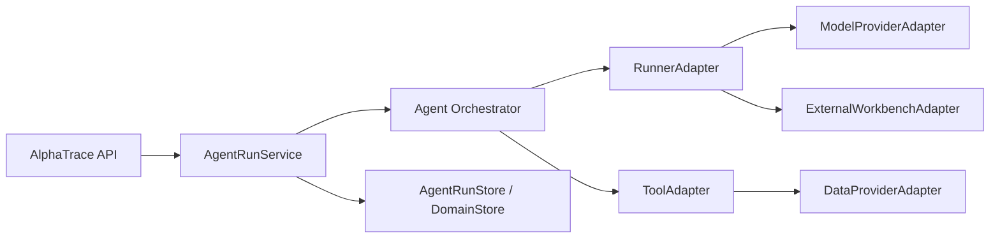

# AlphaTrace Integration Abstraction Layer

Status: M118/M125 design baseline.  
Date: 2026-05-05.

## Goal

AlphaTrace needs a stable abstraction layer for future open-source and commercial components:

1. Data APIs: Bocha now, professional market/news/fund providers later.
2. Model providers: Qwen/DashScope now, future multi-provider routing and fallback.
3. Tools: evidence retrieval, market context, document parsing, chart/table generation.
4. Runners: Stub, Qwen, AlphaTrace Native, TradingAgents, LangAlpha external service, custom engines.
5. Async task execution: in-process MVP, subprocess isolation, future durable worker/scheduler.

The abstraction must keep AlphaTrace as the product backend. External runtimes execute work, but all product-facing state is mapped into AlphaTrace schemas.

## Layer Map

## Core Contracts

### DataProviderAdapter

Responsible for fetching or searching external/domain data and returning normalized data results.

Examples:

1. Bocha web search.
2. Static evidence seed.
3. Future market quote provider.
4. Future fund NAV provider.
5. Future document/file corpus provider.

Required concerns:

1. Provider ID and capability metadata.
2. Credential source status.
3. Timeout and retry policy.
4. Normalized result payload.
5. Evidence/artifact mapping hints.

### ModelProviderAdapter

Responsible for model invocation independent of runner orchestration.

Examples:

1. Qwen/DashScope OpenAI-compatible API.
2. Future OpenAI/Anthropic/DeepSeek/Ollama providers.
3. LangAlpha BYOK service bridge if externalized.

Required concerns:

1. Provider/model readiness.
2. Streaming vs non-streaming behavior.
3. Token/cost metrics.
4. Redaction and key isolation.
5. Structured-output capability.

### ToolAdapter

Responsible for an auditable backend tool call.

Examples:

1. `evidence.retrieve`.
2. `bocha.search`.
3. `market.context.load`.
4. `portfolio.context.load`.
5. Future `document.parse`, `chart.generate`, `claim.validate`.

Tool calls must have explicit contract metadata so the UI can distinguish real backend tools from model-only reasoning.

### RunnerAdapter

Already exists in `backend/services/agent_runners/base.py`.

Runner responsibility:

1. Execute a task or submit a background execution.
2. Append runtime events.
3. Emit reports/evidence/decision.
4. Preserve failure reason.

Runner non-responsibility:

1. It must not define frontend schemas.
2. It must not own product persistence beyond callbacks.
3. It must not expose internal runtime state directly.

### ExternalWorkbenchAdapter

For systems like LangAlpha that are complete agent workbenches, not lightweight in-process runners.

Responsibilities:

1. Submit external task/workspace/thread.
2. Poll or stream external events.
3. Download or summarize external artifacts.
4. Map results to AlphaTrace AgentRun/Event/Report/Evidence/Decision.

Non-goals:

1. Do not embed LangAlpha backend into AlphaTrace process.
2. Do not expose LangAlpha workspace/thread IDs as primary product IDs.
3. Do not require LangAlpha DB/Redis for AlphaTrace core runtime.

## Async Task Abstraction

AlphaTrace should support three execution modes through one task model:

| Mode | Current/Future | Use Case |
|---|---|---|
| In-process thread | Current | Qwen/Native short bounded runs. |
| Subprocess worker | Current PoC | TradingAgents isolation and killability. |
| Durable worker | Future | Cancel/retry/reconnect, multi-run scheduling, production stability. |

Minimum task fields:

1. `taskId` / `runId`.
2. `taskType` and `runnerType`.
3. `status`: pending, running, completed, failed, cancelled, timed_out.
4. `startedAt`, `updatedAt`, `completedAt`.
5. `attempt`, `timeoutSeconds`, `cancellationRequested`.
6. `errorCode`, `errorMessage`.
7. `payload` and `result` JSON.

## Data API Management Direction

Provider data must flow through a managed API layer:

1. DataSource catalog records provider identity, auth mode, scope, and health.
2. Provider adapters execute retrieval behind timeout/retry/redaction.
3. Raw provider payloads are stored only as metadata or artifacts, not frontend contracts.
4. Evidence items carry canonical URL/source/title/summary plus provider metadata.
5. Reports and decisions cite evidence IDs; evidence IDs resolve to detail pages.

## Module-To-LLM Boundary

Each module that calls a model should be represented as a bounded LLM task:

1. Inputs: task context, evidence, tool outputs, instructions, schema target.
2. Model provider: provider/model/base URL/key source status.
3. Output: live chunks, structured JSON, report section, metrics.
4. Fallback: raw report and safe watch decision.
5. Validation: evidence ID validation and future semantic support scoring.

This is the reason the model provider adapter should be separate from runner orchestration.

## TradingAgents vs LangAlpha Integration Shape

| System | Best integration shape | Why |
|---|---|---|
| TradingAgents | RunnerAdapter or subprocess worker | It is a LangGraph research runtime centered on ticker analysis. |
| LangAlpha | ExternalWorkbenchAdapter / architecture reference | It is a full workbench backend with DB/Redis/sandbox/workspace lifecycle. |
| AlphaTrace Native | Product Orchestrator | AlphaTrace-owned DAG and schema; preferred commercial path. |

## Implementation Sequence

1. Add interface skeletons without wiring.
2. Refactor Bocha/static market/evidence retrieval to implement DataProvider/ToolAdapter surfaces.
3. Extract Qwen model call into ModelProviderAdapter.
4. Extract Native DAG plan from `qwen_runner.py` into `agent_orchestrator`.
5. Add durable task table in MySQL, but keep JSON fallback.
6. Add artifact model for tables/charts/files.
7. Only then deepen TradingAgents/LangAlpha integration.

## Acceptance

1. Future integrations know which interface to implement.
2. Provider-specific details do not leak into frontend contracts.
3. Async task behavior has one status vocabulary.
4. The design supports TradingAgents and LangAlpha without replacing the main backend.
