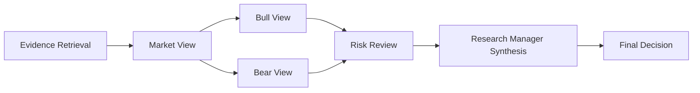

# Orchestration Boundary Model: Native, LangGraph, TradingAgents, LangAlpha

Status: M119 design baseline.  
Date: 2026-05-05.

## Goal

Define one AlphaTrace orchestration vocabulary that can describe:

1. AlphaTrace Native product DAG.
2. TradingAgents LangGraph PoC runtime.
3. LangAlpha external workbench/subagent runtime.

The frontend must still consume only AlphaTrace runtime schemas.

## Canonical AlphaTrace Orchestration Vocabulary

| Concept | Meaning | Frontend Exposure |
|---|---|---|
| `OrchestrationPlan` | Logical task DAG for a run. | Optional runtime metadata; not a separate API requirement yet. |
| `OrchestrationStep` | Product-level step such as Evidence Retrieval or Risk Review. | Mapped to Agent Progress Board and runtime events. |
| `StepExecutionSnapshot` | Step status/progress/summary. | Derived from runtime events and future task state. |
| `AgentRuntimeEvent` | Auditable event stream. | Canonical visible execution trace. |
| `AgentReport` | Human-readable and structured report output. | Canonical report view. |
| `AgentDecision` | Product decision outcome. | Canonical decision card. |

## Native AlphaTrace Plan

Native runner target:

1. Build explicit `OrchestrationPlan` before execution.
2. Emit `agent.started`, `tool.called`, `tool.result`, `reasoning.chunk`, `report.generated`, `decision.updated` with `stepId` and `dependsOn`.
3. Keep evidence retrieval and market context as real backend tools.
4. Keep model-only reasoning separate from tool execution.

## TradingAgents LangGraph Mapping

TradingAgents internal node/state should be mapped, not exposed.

| TradingAgents concept | AlphaTrace mapping |
|---|---|
| Graph start | `agent.run.started`, `agent.started` for TradingAgentsAdapter. |
| Analyst node start/end | `agent.started` / `agent.completed` with `stepId`. |
| Tool calls | `tool.called` / `tool.result`. |
| Debate messages | `debate.message`. |
| Risk team output | `risk.warning` and Risk Review report. |
| Final trade decision | `decision.updated` and TradingAgents PoC report. |
| Checkpoint | Internal runner metadata only. |

PoC limitation:

1. Current TradingAgents path may not stream all LangGraph internals.
2. Subprocess worker log/event bridge is the safe boundary.
3. TradingAgents defaults to ticker-style tasks; AlphaTrace assets require explicit mapping.

## LangAlpha External Workbench Mapping

LangAlpha should be treated as a service-style external workbench.

| LangAlpha concept | AlphaTrace mapping |
|---|---|
| Workspace | Future AlphaTrace Research Workspace or payload metadata. |
| Thread/task | AgentRun and AsyncTask. |
| SSE event buffer | AgentRuntimeEvent stream, with replay cursor mapping. |
| Subagents | OrchestrationStep / StepExecutionSnapshot. |
| Files/artifacts | Future AgentArtifact. |
| PTC/sandbox result | ToolInvocationResult / AgentArtifact. |
| BYOK/vault | AlphaTrace SystemConfig/secret vault, not frontend. |

## Product Rule

Only AlphaTrace IDs are product IDs:

1. `runId`.
2. `eventId`.
3. `reportId`.
4. `evidenceId`.
5. `decisionId`.
6. future `artifactId`.

External IDs can exist only in payload metadata for diagnostics.

## Refactor Implications

1. Extract Native plan construction from runner execution.
2. Add step snapshots derived from events before adding DB task state.
3. Keep TradingAgents/LangAlpha mappers additive.
4. Do not let any external framework define frontend layout or product persistence.
