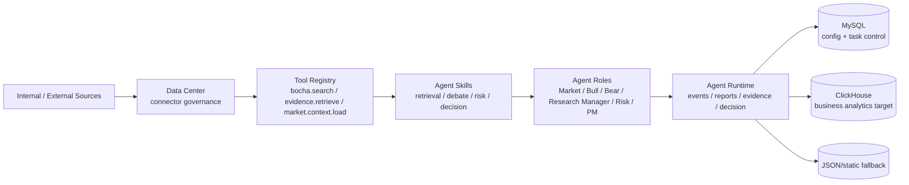
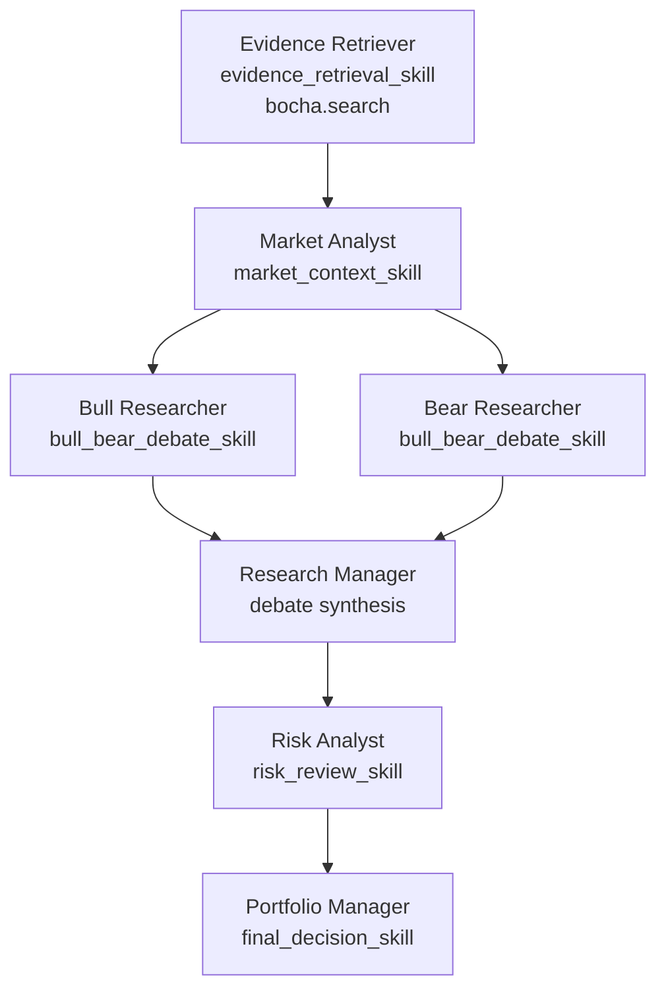

# AlphaTrace Data Center, Tool, Skill, Agent Flow

Date: 2026-05-05
Status: Architecture contract

## Purpose

AlphaTrace needs a durable boundary between data ingestion, tool execution, skill configuration, multi-agent orchestration, and product persistence. This document defines that boundary before deeper TradingAgents/LangAlpha/professional-data integration.

## Core Rule

Bocha is a backend tool provider. It is not the Data Center and not the durable business data store.

MySQL stores system configuration, credential metadata, task snapshots, and lightweight run-control state.

ClickHouse is the target store for structured business and analytical data: market facts, evidence projections, runtime events, reports, decisions, leaderboard facts, portfolio analytics, and strategy analytics.

## Control Planes

| Plane | Owns | Does Not Own |
|---|---|---|
| Data Center | Connector onboarding, credential policy, freshness policy, store routing, legacy isolation | Agent reasoning or final decisions |
| Tool Registry | Backend-callable capabilities such as `bocha.search`, `market.context.load`, `evidence.retrieve`, model calls | Durable product persistence |
| Skill Catalog | Capability bundles that bind agent roles to tools, data domains, model requirements, and output contracts | Provider-specific implementation details |
| Agent Orchestrator | DAG, roles, task specs, dependency order, run lifecycle | External framework internal state |
| Runner Adapter | Executes a task through Qwen, AlphaTrace Native, TradingAgents, LangAlpha, or custom runner | Product schema ownership |
| Product Stores | AlphaTrace-owned persisted schema | External checkpoints or raw provider state |

## Data Flow

## Agent Role Binding Flow

## Store Routing

| Data | Runtime Shape | Target Store | Fallback |
|---|---|---|---|
| System configuration | provider status, credential metadata, feature flags | MySQL | environment variables |
| Task snapshots | task spec, lightweight status, cancellation/retry metadata | MySQL | in-memory/process state |
| Runtime events | `AgentRuntimeEvent` | ClickHouse | MySQL/JSON during transition |
| Reports | `AgentReport` | ClickHouse | MySQL/JSON during transition |
| Evidence projections | `EvidenceReference`, URL artifacts, source metadata | ClickHouse | static seed/run-scoped evidence |
| Decisions | `AgentDecision` | ClickHouse | AgentRun-derived projection |
| Market facts | quote/snapshot/kline/indicator/fund NAV/index constituents | ClickHouse | static market seed |
| Leaderboard facts | runtime quality metrics, evidence/report/decision counts | ClickHouse | computed from AgentRun store |

## Tool Boundary

A tool output becomes product data only after mapping into AlphaTrace schemas:

1. Raw provider result is received by backend adapter.
2. Tool result is normalized into `EvidenceReference`, `AgentArtifact`, `market_context`, or typed runtime payload.
3. Agent Runtime emits `tool.called`, `tool.result`, and optional artifact/evidence events.
4. Product stores persist the normalized shape, not the provider's private state.

## Skill Boundary

A skill is a product-level capability descriptor. It names:

1. Allowed agent roles.
2. Tool IDs the role may call.
3. Data domains the skill may consume.
4. Model requirements.
5. Output contracts the skill must produce.

Skills are not code execution engines. Runners implement skills through Qwen calls, Native orchestration, TradingAgents nodes, LangAlpha service tasks, or future custom adapters.

## External Framework Boundary

TradingAgents and LangAlpha can be useful, but neither should own AlphaTrace product schema.

| Component | Preferred role | Boundary |
|---|---|---|
| TradingAgents | Optional in-process/subprocess runner for research DAG PoC | Map internal nodes/messages to AlphaTrace agent roles, events, reports, decisions |
| LangAlpha | Architecture reference or future external workbench service | Submit/fetch artifacts through adapter, then map to AgentArtifact/Report/Decision |
| Bocha | Backend tool provider | `bocha.search` tool output maps to evidence/artifacts |

## Implementation Contracts Added

- `GET /api/alpha-trace/agent-runs/runtime/data-center`
- `GET /api/alpha-trace/agent-runs/runtime/skills`
- `GET /api/alpha-trace/agent-runs/runtime/agent-skill-bindings`
- `GET /api/alpha-trace/agent-runs/runtime/architecture-review`

## Open Implementation Work

1. Implement ClickHouse schema catalog and migration plan.
2. Add runtime tool-result to ClickHouse projection path.
3. Add per-run skill configuration validation before execution.
4. Add a UI surface that lets operators inspect Data Center connectors, Skills, and Role Bindings outside reusable panels.
5. Map TradingAgents/LangAlpha outputs to the same binding matrix when those adapters are enabled.
